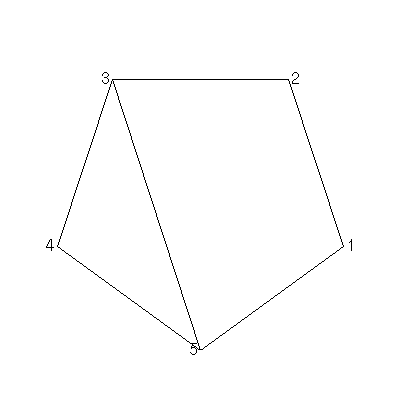
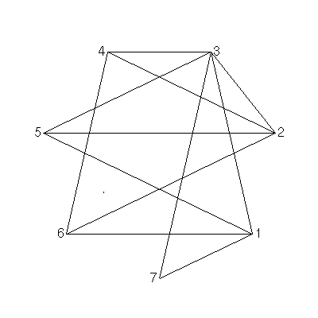
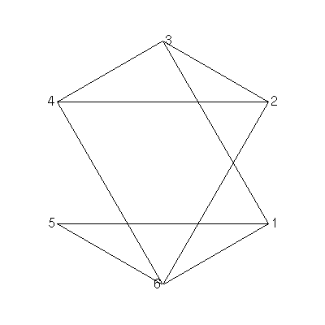

## GraPhY

Visualize graphs using python!

### Dependencies:
* [graphics.py](https://pypi.org/project/graphics.py/)
* [Tkinter](https://wiki.python.org/moin/TkInter)

### Usage

Input an adjacency list into input.txt and run main.py. The nodes will always belong to a circle, but are isomorphic to the one you copied the nodes and edges from.
